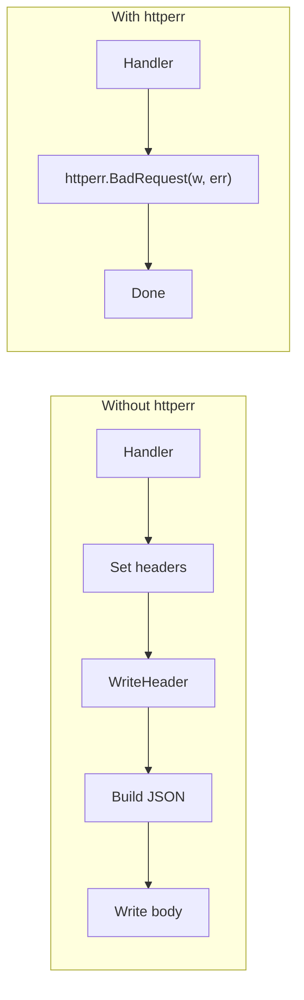
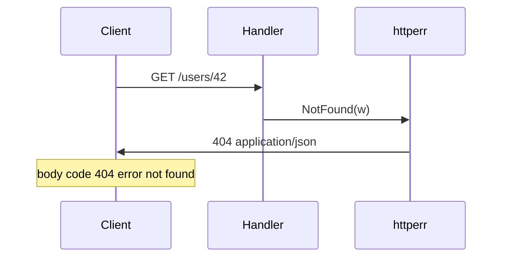

# httperr

Concise JSON HTTP error helpers for Go.

[](https://pkg.go.dev/github.com/oleh-anfimov/httperr)


## Motivation

Writing HTTP error responses by hand is repetitive and easy to get wrong:

```go
w.Header().Set("Content-Type", "application/json")
w.WriteHeader(http.StatusBadRequest)
json.NewEncoder(w).Encode(map[string]any{"code": 400, "error": err.Error()})
```

Common pain points:

- Boilerplate on every error path in every handler
- Easy to forget `Content-Type: application/json`
- Dynamic messages can produce invalid JSON when quotes or special characters are not escaped
- Inconsistent response shape across handlers

With **httperr**, one call handles the response:

```go
httperr.BadRequest(w, err)
```

What you get:

- Consistent JSON shape: `{"code": <status>, "error": "<message>"}`
- `Content-Type: application/json` set automatically
- Proper JSON escaping for dynamic error messages
- Pre-marshaled bodies for common static errors (no marshal work per request)

## How it works





## Installation

Requires Go 1.16 or later. No third-party runtime dependencies.

```bash
go get github.com/oleh-anfimov/httperr
```

## Quick start

```go
package main

import (
	"net/http"

	"github.com/oleh-anfimov/httperr"
)

func getUser(w http.ResponseWriter, r *http.Request) {
	id := r.URL.Query().Get("id")
	if id == "" {
		httperr.NotFound(w)
		return
	}
	// lookup user by id...
}
```

Example response:

```json
{"code":404,"error":"not found"}
```

## Usage

| Scenario | Code | Message source |
|----------|------|----------------|
| Dynamic client error | `httperr.BadRequest(w, err)` | `err.Error()` |
| Static client error | `httperr.NotFound(w)` | fixed sentinel |
| Custom status | `httperr.ErrResponse(w, 418, err)` | any HTTP status |
| Server error | `httperr.InternalServerError(w)` | fixed sentinel |

Dynamic helpers (`BadRequest`, `Forbidden`, `Unauthorized`, and others that take an `error`) use `err.Error()` as the message. If `err` is `nil`, the `"error"` field is empty.

Static helpers use predefined sentinel errors from the package:

```go
httperr.Unauthorized(w, httperr.ErrUnauthorized)
httperr.Conflict(w, errors.New("email already exists"))
httperr.InternalServerError(w)
```

## API reference

### Client errors (4xx)

| Function | Status | Notes |
|----------|--------|-------|
| `BadRequest(w, err)` | 400 | dynamic message |
| `Unauthorized(w, err)` | 401 | dynamic message |
| `Forbidden(w, err)` | 403 | dynamic message |
| `NotFound(w)` | 404 | uses `ErrNotFound` |
| `RequestTimeout(w)` | 408 | uses `ErrRequestTimeout` |
| `Conflict(w, err)` | 409 | dynamic message |
| `UnprocessableEntity(w, err)` | 422 | dynamic message |
| `TooManyRequests(w)` | 429 | uses `ErrTooManyRequests` |
| `ErrResponse(w, code, err)` | any | generic helper |

### Server errors (5xx)

| Function | Status | Notes |
|----------|--------|-------|
| `InternalServerError(w)` | 500 | uses `ErrInternalServer` |
| `NotImplemented(w)` | 501 | uses `ErrNotImplemented` |
| `BadGateway(w)` | 502 | uses `ErrBadGateway` |
| `ServiceUnavailable(w)` | 503 | uses `ErrServiceUnavailable` |
| `GatewayTimeout(w)` | 504 | uses `ErrGatewayTimeout` |
| `HTTPVersionNotSupported(w)` | 505 | uses `ErrHTTPVersionNotSupported` |

### Sentinel errors

| Variable | Used by |
|----------|---------|
| `ErrNotFound` | `NotFound` |
| `ErrRequestTimeout` | `RequestTimeout` |
| `ErrTooManyRequests` | `TooManyRequests` |
| `ErrInternalServer` | `InternalServerError` |
| `ErrNotImplemented` | `NotImplemented` |
| `ErrBadGateway` | `BadGateway` |
| `ErrServiceUnavailable` | `ServiceUnavailable` |
| `ErrGatewayTimeout` | `GatewayTimeout` |
| `ErrHTTPVersionNotSupported` | `HTTPVersionNotSupported` |
| `ErrUnauthorized` | default message for `Unauthorized` |
| `ErrConflict` | default message for `Conflict` |
| `ErrUnprocessable` | default message for `UnprocessableEntity` |

## Documentation

Run `go doc github.com/oleh-anfimov/httperr` locally, or see [pkg.go.dev](https://pkg.go.dev/github.com/oleh-anfimov/httperr).

Contributions and issue reports are welcome.
